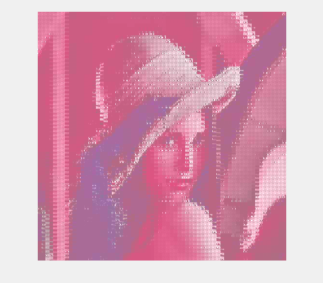
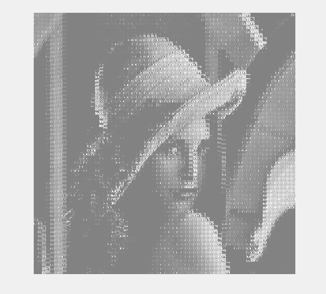
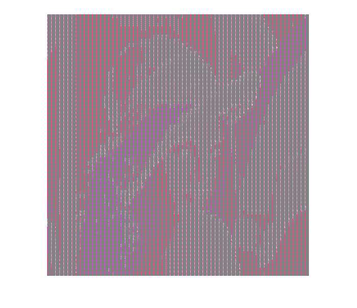
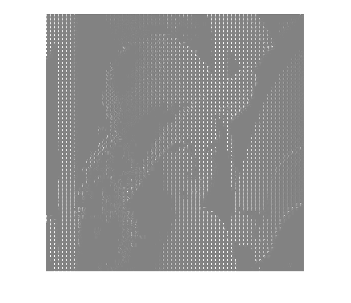

# JPEG-Compression-in-Matlab
JPEG Compression using DCT (Discrete Cosine Transform) and DWT (Discrete Wavelet Transform) in Matlab.

# The steps included in the compression phase are as follows:

Color Transform

Range Mapping

Patch Generation

DCT

Quantization

Zigzag Encoding

Huffman Encoding

# The steps included in the decompression phase are as follows:

Huffman Decoding

Zigzag Decoding

Inverse Quantization

Inverse DCT

Inverse Patch Generation

Inverse Range Mapping

Inverse Color Transform

# Color Transform

It is a simple conversion from RGB to YCbCr.

# Range Mapping

It is the step to simply subtract 128 from the image to get the image range in [-128,127].

# Patch Generation

In this step, 8*8 patches are generated of the input image and all other operations are performed patch wise.

# DCT

In this step Discrete Cosine Transform is applied on a patch.

# Quantization

It simply divides the pixels by a certain amount different for different channels. 

I used the following quantization table for Y channel 

Y_Q = [16 11 10 16 24 15 1 61;12 12 14 19 26 58 60 55;14 13 16 24 40 57 69 56;14 17 22 29 51 81 80 62;18 22 37 56 68 109 103 77;24 35 55 64 81 104 113 92;49 64 78 87 103 121 120 101;72 92 95 98 112 100 103 99];

The quantization table used for Cb and Cr channels is

Cb_Cr_Q = [17 18 24 47 99 99 99 99;18 21 26 66 99 99 99 99;24 26 56 99 99 99 99 99;47 66 99 99 99 99 99 99;99 99 99 99 99 99 99 99;99 99 99 99 99 99 99 99;99 99 99 99 99 99 99 99;99 99 99 99 99 99 99 99];

# Zigzag Encoding

This step involves rearranging the 64 values in a zigzag pattern such that all 0's appear collectively at the end. The zigzag pattern is as follows

RLE_i = [1 2 9 17 10 3 4 11;18 25 33 26 19 12 5 6;13 20 27 34 41 49 42 35;28 21 14 7 8 15 22 29;36 43 50 57 58 51 44 37;30 23 16 24 31 38 45 52;59 60 53 46 39 32 40 47;54 61 62 55 48 56 63 64];

# Huffman Encoding

Huffman encoding follows a tree structure to encode in the form of 0's and 1's using probability of each distinct value.

The decompression process is literally the inverse of each individual step in compression applied reverse in order. 

For instance, Inverse quantization is basically multiplying the same tables which were divided in compression. 

Inverse range mapping simply involves adding 128 to the image instead of subtracting it. 

Inverse color transform simply includes the conversion from YCbCr to RGB.

I also tried Discrete Wavelet Transform for which I kept the entire process exactly the same just replacing DCT with DWT.

As far as 2D images are concerned, same process is followed except that at the start all three channels are created with the same values so as to convert it in to a 3D image.

# Results using DWT

 

# Results using DCT

 

# Code Structure

# jpeg

It contains the code for the complete pipeline using DCT.

# jpeg_2000

It contains the complete pipeline using DWT.

# compression_jpeg

It contains only the compression part using DCT.

# decompression_jpeg

It contains only the decompression part using DCT.

# compression_jpeg_2000

It contains only the compression part using DWT.

# decompression_jpeg_2000

It contains only the decompression part using DWT.

# jpeg_gui

Compression using DCT with GUI.

# jpeg_2000_gui

Compression using DWT with GUI.

# References

https://medium.com/breaktheloop/what-is-ycbcr-964fde85eeb3

https://medium.com/breaktheloop/jpeg-compression-algorithm-969af03773da

https://www.youtube.com/watch?v=Q2aEzeMDHMA

http://ijcsit.com/docs/Volume%205/vol5issue02/ijcsit20140502346.pdf
